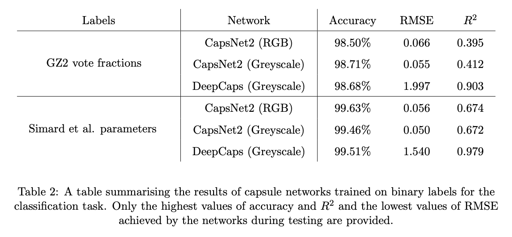
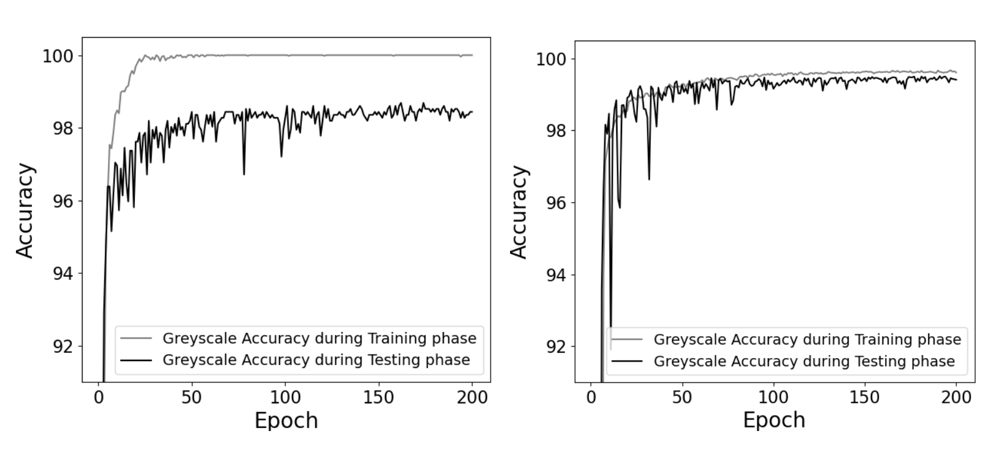

# 🧠 DeepCaps_Pytorch  
> PyTorch implementation and training of *DeepCaps: Going Deeper with Capsule Networks*


# 🚀 Overview

**DeepCaps_Pytorch** is a PyTorch implementation of *DeepCaps: Going Deeper with Capsule Networks*, based on the paper
"DeepCaps: Going Deeper with Capsule Networks" (Rajasegaran et al., 2019). See: https://arxiv.org/abs/1904.09546

This project adapts the DeepCaps architecture for applications such as galaxy morphology classification (using SDSS / Galaxy Zoo data) as part of an academic research investigation.  
It demonstrates how Capsule Networks can be extended to deeper architectures and compared against CNN-based baselines.

<br/>

# ✨ Features

- 🧩 Modular implementation of DeepCaps architecture in PyTorch  
- 📈 Training, evaluation, and prediction scripts  
- 🪐 Dataset support for SDSS / Galaxy Zoo images  
- ⚙️ Configuration system (`cfg.py`) for hyperparameter tuning  
- 📊 Visualization tools for accuracy and loss curves  
- 🧠 Easily extendable to new datasets and domains  

<br/>

# 🧠 Tech Stack

- **Language:** Python 3.10+  
- **Framework:** PyTorch  
- **Visualization:** Matplotlib, Seaborn  
- **Utilities:** NumPy, tqdm, Pillow  

<br/>


# 📁 Project Structure

```plaintext

├── acc_plot.py           # Plot accuracy/loss curves
├── cfg.py                # Configuration / hyperparameters
├── helpers.py            # Utility functions
├── load_data.py          # Dataset loader base
├── load_data_sdss.py     # SDSS-specific data loader
├── model.py              # DeepCaps architecture
├── plot.py               # Visualization utilities
├── predictor.py          # Inference and prediction
├── train.py              # Model training script
├── requirements.txt
└── README.md
```


# ⚙️ Installation

Clone the repository and install dependencies:

```bash
git clone https://github.com/Commit2Cosmos/DeepCaps_Pytorch.git
cd DeepCaps_Pytorch
pip install -r requirements.txt
```

If using a GPU, ensure PyTorch is installed with CUDA support.
You can verify this by running:

```bash
python -c "import torch; print(torch.cuda.is_available())"
```


# 💻 Usage

## 🏋️ Training


To train the DeepCaps model, simply run:

```bash
python train.py
```

You can modify hyperparameters (epochs, learning rate, dataset paths, etc.) inside cfg.py.


## 🔮 Prediction / Inference

Once trained, you can run inference using:

```bash
python predictor.py
```

<br/>

# 📊 Examples / Results


<div style="background-color: white; padding: 5px; margin: 25px 0px">
    
</div>


<div style="background-color: white; padding: 0px;margin: 25px 0px">
    
</div>

<br/>

# 🧩 How to Use with Your Own Dataset

1.	Update cfg.py — modify dataset paths, batch size, and training hyperparameters.
2.	Add a new loader — write a new dataset class in load_data.py following the torch.utils.data.Dataset interface.
3.	Edit train.py — point the dataset reference to your new loader.
4.	Run training — DeepCaps will adapt to the new data dimensions and classes.
5.	Evaluate and visualize — use acc_plot.py and plot.py to generate metrics.


<br/>

# 📚 References

1. [Rajasegaran, J., Jayasundara, V., Jayasekara, S., et al. (2019). DeepCaps: Going Deeper with Capsule Networks. arXiv:1904.09546](https://arxiv.org/abs/1904.09546)
2. [Original TensorFlow Implementation](https://github.com/HopefulRational/DeepCaps-PyTorch)
3. [PyTorch Reference Implementation](https://github.com/Ugenteraan/DeepCaps)
4. [Galaxy Zoo dataset](https://data.galaxyzoo.org)